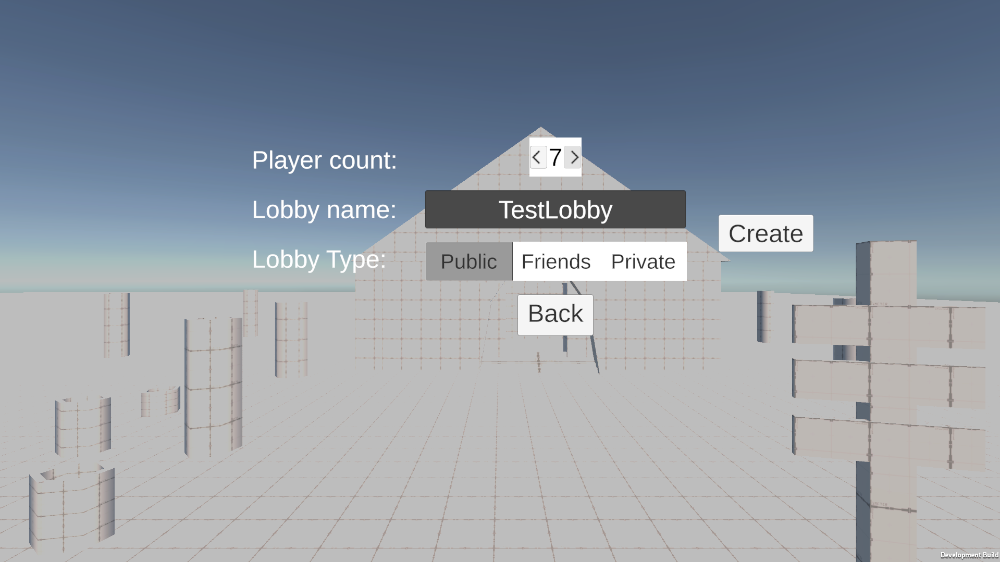
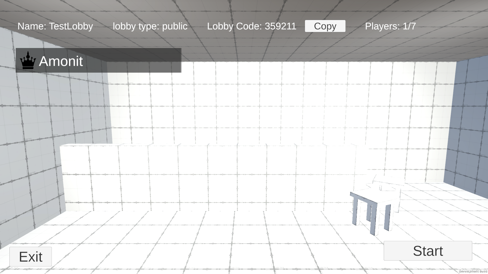
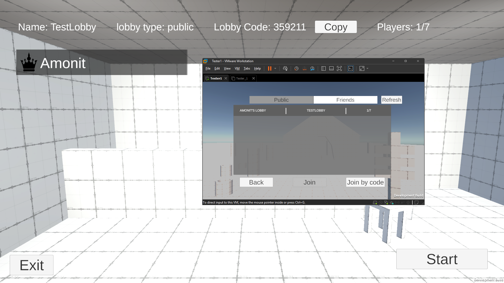

# Lobby & Matchmaking IS

Проект по дисциплине «Методы и средства проектирования информационных систем и технологий».

## 1. Краткое описание проекта

**1.1. Разработчик:** Сучалкин Денис Александрович  
**1.2. Группа:** Д-Э 306  
**1.3. Тема проекта:** Информационная система лобби и матчмейкинга для многопользовательской игры в Steam  

**1.4. Цель проекта:**  
спроектировать и описать систему лобби для многопользовательской игры в Steam, обеспечивающую создание комнаты, просмотр списка доступных лобби и присоединение пользователя к выбранной комнате.

**1.5. Задачи проекта:**
- описать предметную область и основные сценарии работы лобби в Steam (создание комнаты, просмотр списка, присоединение к комнате);
- определить акторов системы и их права (пользователь, система лобби);
- сформулировать функциональные и нефункциональные требования к системе лобби;
- разработать модели процессов в нотациях IDEF0, DFD и BPMN для сценариев создания комнаты, просмотра списка и присоединения;
- определить основные сущности данных (Lobby, Player, Member) и их атрибуты;
- оформить результаты проектирования в виде комплекта документации в формате Markdown.

**1.6. Аннотация:**  
Информационная система лобби и матчмейкинга для многопользовательской игры в Steam предназначена для организации предварительного этапа сетевой игры. Система позволяет пользователю создать комнату с заданными параметрами доступа и вместимости, просмотреть список доступных лобби и присоединиться к выбранной комнате, в том числе по коду приглашения.  
В рамках проекта выполняется анализ предметной области, формулируются функциональные и нефункциональные требования, разрабатываются модели процессов в нотациях IDEF0, DFD и BPMN, а также описываются основные сущности и данные, используемые системой. Полученный комплект проектной документации может быть использован как основа для дальнейшей программной реализации системы лобби.

## 2. Документация (Markdown)

2.1. Подробное описание проекта - [Overview](docs/01-overview.md)  
2.2. Ментальная карта (с комментариями) - [Mind map](docs/02-mindmap.md)  
2.3. Модель в нотации IDEF0 (с комментариями) - [IDEF0 model](docs/03-idef0-notes.md)  
2.4. Фрагменты модели в нотации DFD (с комментариями) - [DFD fragments](docs/04-dfd-notes.md)  
2.5. Модель в нотации BPMN (с комментариями) - [BPMN model](docs/05-bpmn-notes.md)  
2.6. Модели в нотации UML (структурные и поведенческие диаграммы) - [UML diagrams](06-uml.md)  
2.7. ER-диаграмма - [ER diagram](07-er.md)

## 3. Database (PostgreSQL)

В рамках проекта выполнено логическое и физическое проектирование базы данных под PostgreSQL.  
- `db/schema.sql` - создание типов и таблиц (lobbies, players, members).  
- `db/seed.sql` - тестовые данные для примеров.  

База данных фактически не развёрнута, так как основная цель работы - проектирование структуры и связей, а не реализация серверной части.

## 4. Unity prototype

В репозитории дополнительно размещен прототип интерфейса лобби:  
- каталог `unity/` - проект Unity;  
- основная логика лобби реализована в сценах меню и лобби;  
- подключена интеграция со Steam через Steamworks.NET (используется существующий игровой проект).  

Прототип служит иллюстрацией работы спроектированной информационной системы лобби и матчмейкинга.

## 5. Screenshots

**Create lobby panel**  

**Lobby room (players list)**  

**Lobby list**  

**After join**  

