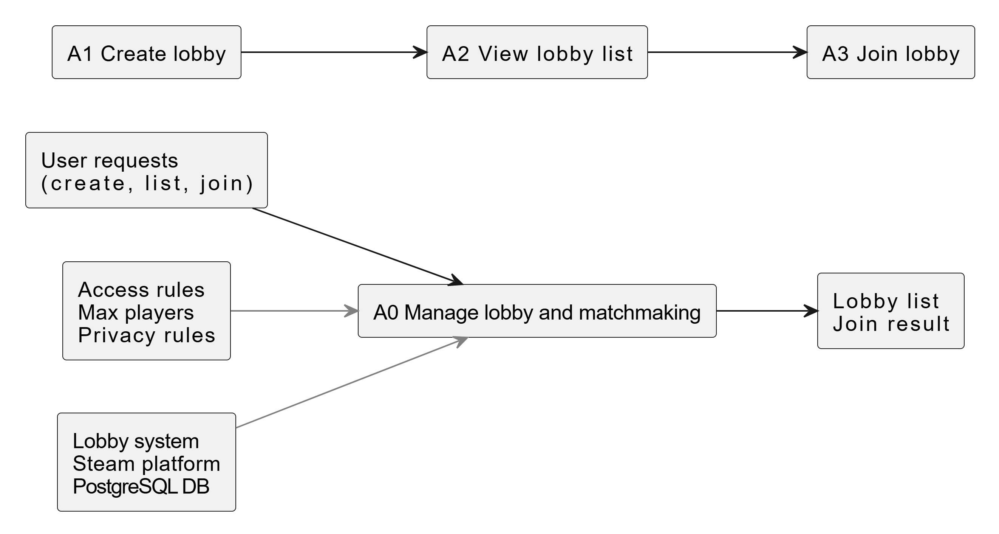

# IDEF0 diagram

## 1. Назначение диаграммы
Диаграмма IDEF0 описывает систему лобби и матчмейкинга как функцию управления лобби:
- на верхнем уровне A0;
- с декомпозицией на подпроцессы A1, A2, A3.

## 2. Диаграмма A0

Функция **A0 Manage lobby and matchmaking** имеет:
- **Входы (Inputs)**  
  запросы пользователя: создать лобби, получить список, присоединиться;
- **Выходы (Outputs)**  
  список лобби, результат присоединения (успех или ошибка);
- **Управляющие воздействия (Controls)**  
  правила доступа (public/private), лимиты игроков, политики приватности;
- **Механизмы (Mechanisms)**  
  клиентский интерфейс, подсистема лобби, платформа Steam, база данных PostgreSQL.

## 3. Декомпозиция A0

В модели выделены три подпроцесса:
- **A1 Create lobby**  
  - принимает параметры лобби (название, тип, maxPlayers);  
  - создаёт запись о лобби и код для приватного доступа;  
  - публикует лобби как доступное для присоединения.

- **A2 View lobby list**  
  - считывает из БД актуальный список открытых лобби;  
  - применяет фильтры при необходимости;  
  - возвращает пользователю список комнат.

- **A3 Join lobby**  
  - принимает запрос на присоединение по списку или по коду;  
  - проверяет доступность комнаты и наличие свободных мест;  
  - добавляет пользователя в состав участников или возвращает ошибку.

## 4. Связь с другими моделями

- Подпроцессы A1, A2, A3 детализируются в DFD уровней P1, P2, P3.  
- Элементы данных (Lobby, Member) соответствуют сущностям ER-диаграммы.  
- Сценарии, показанные в IDEF0, далее раскрываются в BPMN как последовательности шагов.
