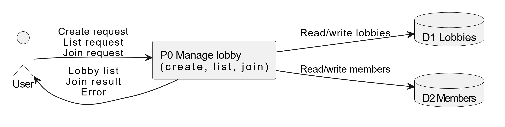
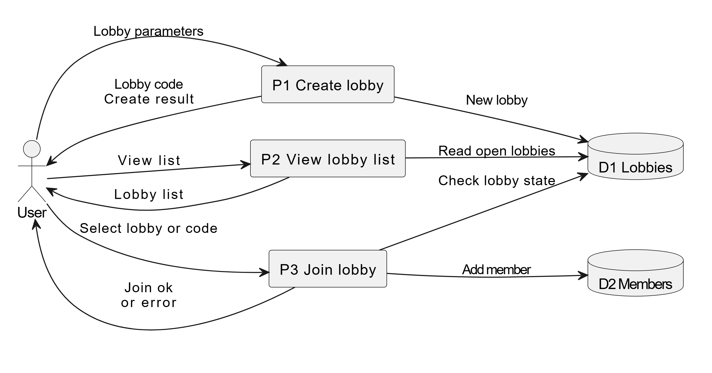

# DFD diagrams

## 1. Назначение
Диаграммы потоков данных (DFD) показывают:
- какие процессы обрабатывают данные;
- какие хранилища используются;
- какие внешние сущности обмениваются информацией с системой.

Используются два уровня: контекстная диаграмма и уровень 1.

## 2. Контекстная диаграмма (P0)

Основные элементы:
- **Внешняя сущность User**  
  отправляет запросы на создание лобби, просмотр списка и присоединение, получает ответы и ошибки.
- **Процесс P0 Manage lobby**  
  обрабатывает все типы запросов, управляет хранилищами лобби и участников.
- **Хранилища D1 Lobbies и D2 Members**  
  содержат данные о доступных лобби и участниках.

Контекстная диаграмма показывает систему как единый процесс без детализации внутренних шагов.

## 3. Диаграмма уровня 1

Выделены три ключевых процесса:
- **P1 Create lobby**  
  - получает параметры новой комнаты;  
  - создаёт запись в D1 Lobbies;  
  - возвращает пользователю результат создания и, при необходимости, код лобби.

- **P2 View lobby list**  
  - получает запрос на список;  
  - считывает открытые лобби из D1;  
  - формирует список и возвращает его пользователю.

- **P3 Join lobby**  
  - принимает выбор комнаты или код;  
  - проверяет состояние лобби в D1 (существует / открыто / есть места);  
  - при успехе добавляет запись в D2 Members;  
  - при ошибке формирует соответствующее сообщение.

## 4. Связь с IDEF0 и BPMN
- Процессы P1, P2, P3 соответствуют A1, A2, A3 из IDEF0.  
- Эти же процессы далее детализируются в BPMN в виде последовательности шагов пользователя и системы.
