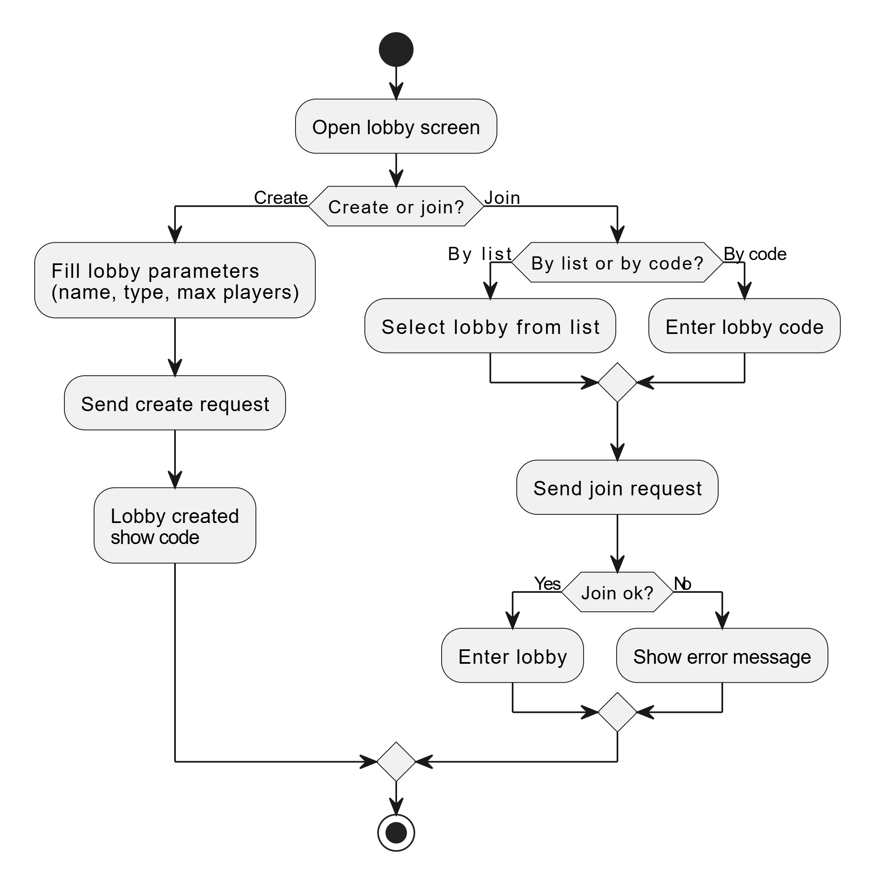

# BPMN process

## 1. Назначение
BPMN-диаграмма описывает основной бизнес-процесс работы с лобби:
- создание комнаты;
- выбор способа присоединения;
- обработку ошибок.

## 2. Основной поток

Ключевые шаги процесса:
1. Пользователь открывает экран лобби в клиенте.  
2. Принимается решение: **создать комнату** или **присоединиться**.
3. В ветке создания:
   - пользователь заполняет параметры лобби (название, тип, maxPlayers);  
   - система создаёт лобби, сохраняет его и показывает результат (в том числе код).  
4. В ветке присоединения:
   - пользователь выбирает комнату в списке или вводит код;  
   - система проверяет существование и доступность;  
   - при успехе пользователь попадает в интерфейс комнаты.

## 3. Обработка ошибок

В процессе предусмотрена проверка:
- на существование лобби;
- на доступность (статус не закрыт);
- на наличие свободных мест.

При нарушении любого из условий:
- процесс переходит в ветку ошибки;
- пользователю возвращается соответствующее сообщение;
- пользователь может повторно выбрать лобби или изменить код.

## 4. Связь с другими моделями

- BPMN опирается на сценарии из раздела 3 файла `01-overview.md`.  
- Логические условия и проверки в BPMN соответствуют операциям процессов P1, P2, P3 в DFD.  
- Состав данных (id, join_code, status) согласован с ER-диаграммой.
