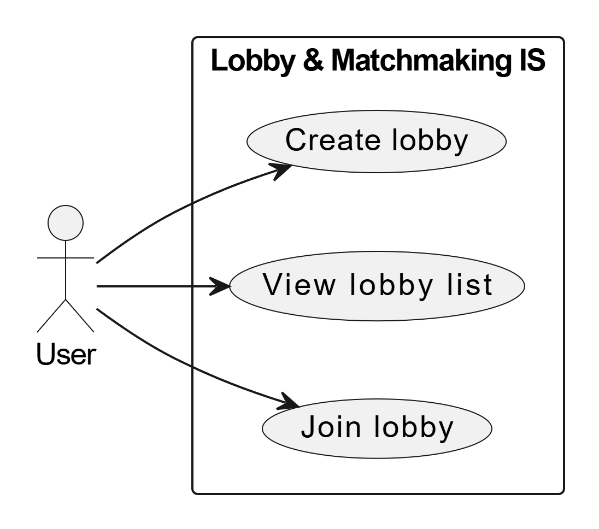
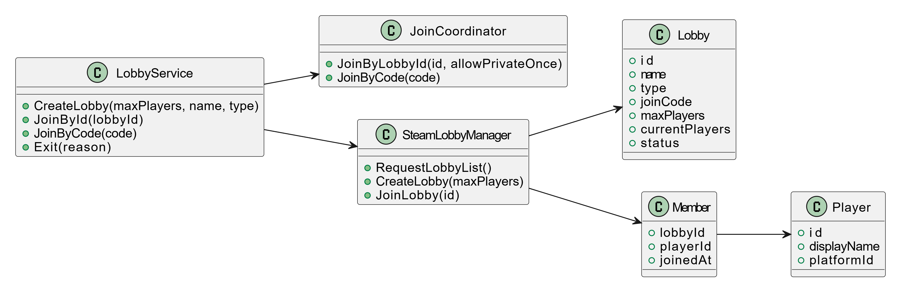

# UML diagrams

## 1. Назначение

Набор UML-диаграмм дополняет функциональное описание:
- показывает случаи использования глазами пользователя;
- отражает структуру основных классов;
- описывает последовательность взаимодействий при присоединении к лобби.

Включены три диаграммы:
- Use case (поведенческая);
- Class diagram (структурная);
- Sequence diagram (поведенческая).

## 2. Use case diagram

  

Диаграмма случаев использования показывает:
- актора **User** как единственного внешнего пользователя системы лобби;
- три базовых варианта использования:
  - Create lobby;
  - View lobby list;
  - Join lobby.

Сценарии согласованы с разделом "Основные сценарии работы" из `01-overview.md`.

## 3. Class diagram

  

На диаграмме классов выделены:
- **LobbyService**  
  фасадный сервис, предоставляющий методы CreateLobby, JoinById, JoinByCode, Exit.
- **JoinCoordinator**  
  отвечает за технические шаги поиска лобби и подключения по идентификатору или коду.
- **SteamLobbyManager**  
  обертка над API Steam для создания и поиска лобби.
- **Lobby, Player, Member**  
  классы, соответствующие сущностям предметной области.

Связи показывают:
- использование LobbyService внутренних компонентов JoinCoordinator и SteamLobbyManager;
- зависимость менеджера лобби от сущностей Lobby и Member.

## 4. Sequence diagram (join by code)

  

Диаграмма последовательности описывает сценарий "присоединение по коду":

1. Пользователь вводит код и нажимает Join в интерфейсе.  
2. UI вызывает метод JoinByCode сервиса LobbyService.  
3. LobbyService перенаправляет запрос в JoinCoordinator.  
4. JoinCoordinator через SteamLobbyManager запрашивает список лобби и находит нужное по коду.  
5. JoinCoordinator инициирует подключение к найденному лобби.  
6. При успехе LobbyService уведомляет UI о переходе в комнату.

Диаграмма демонстрирует порядок вызовов между компонентами и точки, в которых могут возникать ошибки или таймауты.
